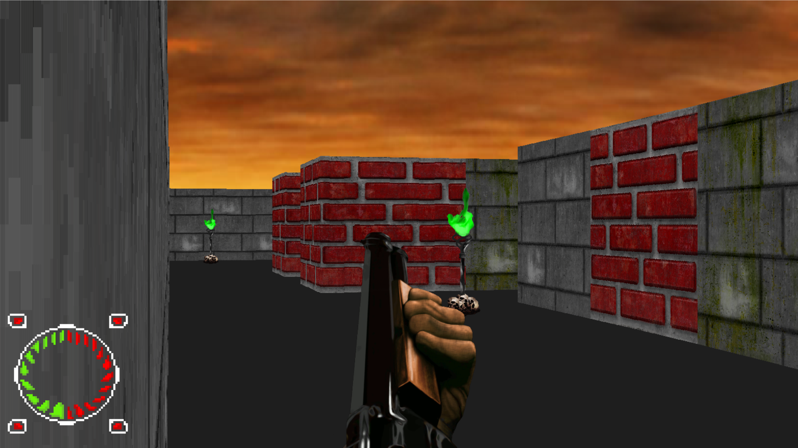
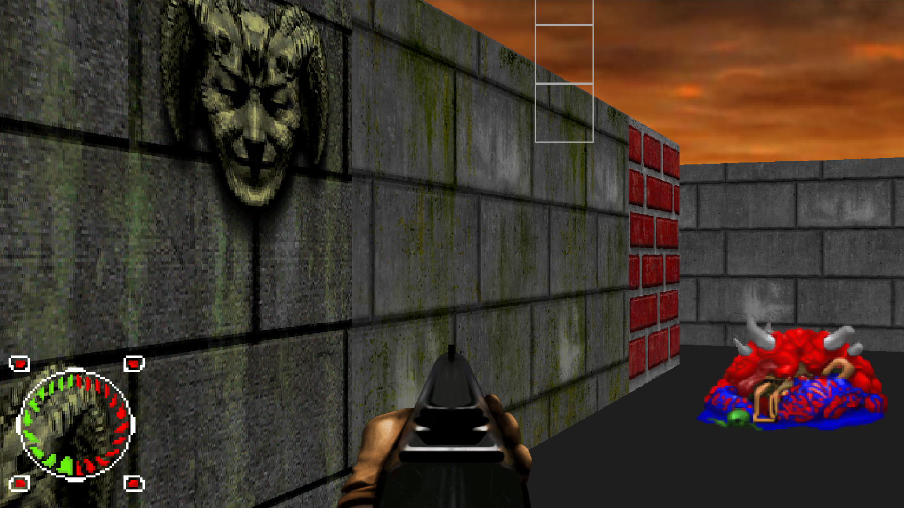
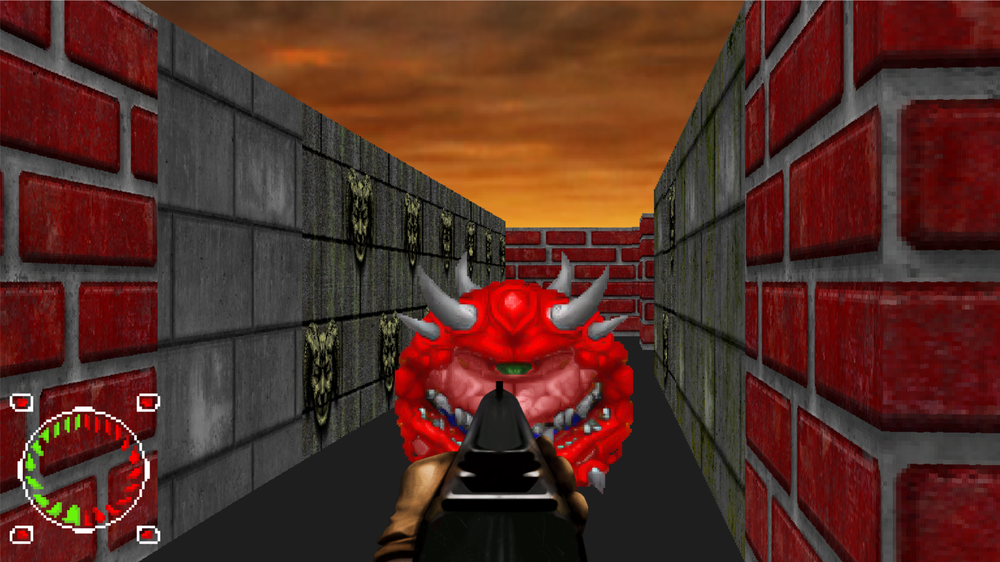

# Doom Clone - Custom Recreation

This repository contains a customized recreation of the classic game **Doom**, developed in Python. The project focuses on implementing and exploring classic algorithms such as Breadth-First Search (BFS), Binary Space Partitioning (BSP), and Raycasting, while adding our own creative approach to the game.

## Project Objective

Create a Doom-inspired gaming experience using concepts from computer graphics and artificial intelligence. This project also serves as an applied study of fundamental algorithms, promoting learning through practice.

## Features Implemented

- **Breadth-First Search (BFS) Algorithm:** Used for enemy navigation or pathfinding on the map.
- **Binary Space Partitioning (BSP):** Implemented for efficient spatial data organization and scene rendering.
- **Raycasting:** A fundamental algorithm for creating simulated 3D graphics in a 2D environment.
- **Custom Game System:** Adding new gameplay elements to make the experience unique.

## Technologies Used

- **Python:** Main programming language for game development.
- **Pygame:** Library used for graphics rendering and event handling.
- **Custom Algorithms:** Implementations of BSP, BFS, and Raycasting adapted for this project.

## How to Run

1. Make sure you have Python 3.8 or later installed.
2. Install the required dependencies by running:

   ```bash
   pip install pygame
   ```
3. Clone this repository:

   ```bash
   git clone https://github.com/ovinicius71/Snake_DOOM
   ```
4. Navigate to the project directory and run the game:

   ```bash
   python main.py
   ```

## In game






## Project Structure

```
|-- assets/                # Resources like images and sounds
|-- snake/                 # is the virtual environment
|-- NPCs/                  # npc folder
    |-- CacoDemonNPC.py    # is a npc game
    |-- CyberDemonNPC.py   # is another npc
    |-- soldierNPC.py      # more one npc
|-- src/                   # Main source code
    |-- bsf.py             # BFS algorithm implementation
    |-- bsp.py             # BSP tree implementation
    |-- raycasting.py      # Raycasting algorithm
    |-- map.py             # map game logic
    |-- main.py            # Game entry point
    |-- object_render.py   # render of menu and walls
    |-- npc.py             # NPC logic
    |-- Player.py          # Player algorithm
    |-- animate_sprite.py  # algorithm of animation
    |-- settings.py        # game settings
    |-- Weapon.py          # Weapon logic
    |-- object_manage.py   # algorithm of manage object (define positions...) 
    |-- README.md          # its me
```

## Contributions

Contributions are welcome! Feel free to open issues or submit pull requests to improve the project.

## Warning 

Still working on the Linux version


